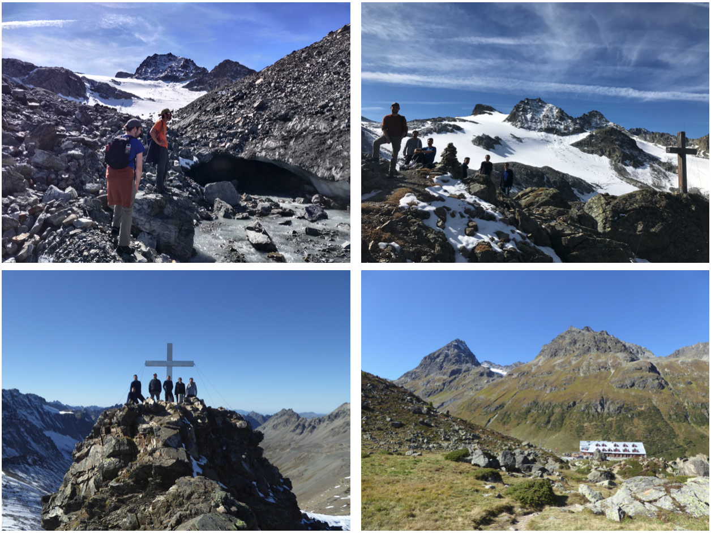

We held our very first annual retreat at the Jamtalhütte in Austria this month. We spent three nights in the mountains hiking, talking physics, and bonding as a team.

It was a great chance for the group to take some time away from our daily research activities to rethink the broader goals of our work. Our group leader, Martin, began with an overview of what our group is trying to achieve: developing a theoretical understanding of many-body quantum systems through analytical and numerical tools. This, of course, is a very broad research mission that many groups around the world have. We discussed that our particular area of interest and expertise is bridging the gap between experimental and theoretical physics and developing methods to connect them. We strive to deeply understand experimental systems such that we can develop the appropriate methods that take experimentally accessible observables and build theoretical methods to extract and understand the physics underpinning the observations.

After that, we each brought everyone up to speed on the state of our individual projects, giving particular focus on the outstanding challenges we all face. It was a great chance to take some extra time to discuss the overlaps between our projects and to realise how other members in the group have skills that could potentially solver other member's problems.

Of course, we did plenty of hiking too! On the first day, we hiked to Rußkopf. We enjoyed lunch on the peak overlooking the valley and then went down into the valley and back up towards the glacier. 

On the second day, we hiked towards Switzerland and up to Futschölpass. After lunch overlooking the Swiss Alps, we followed the Austrian/Swiss border and climbed towards Piz Faschalba. There were some very steep ascents, plenty of snow to trek through, and some truly amazing views. We eventually reached the 3048m peak and spent some time admiring the mountains.

Overall, the group had a fantastic time together. The time away from the office to realign our research goals and identify the synergies within the group was hugely beneficial and will definitely invigorate us for the year ahead!

