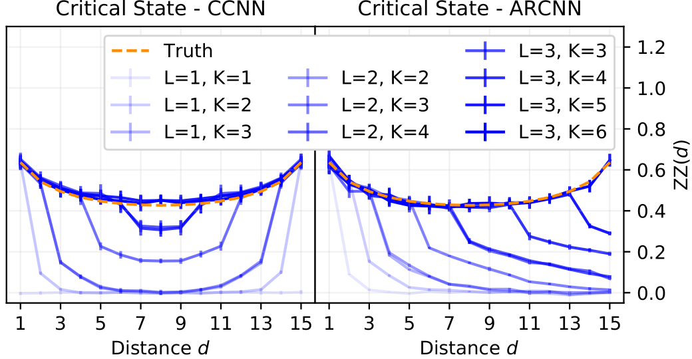
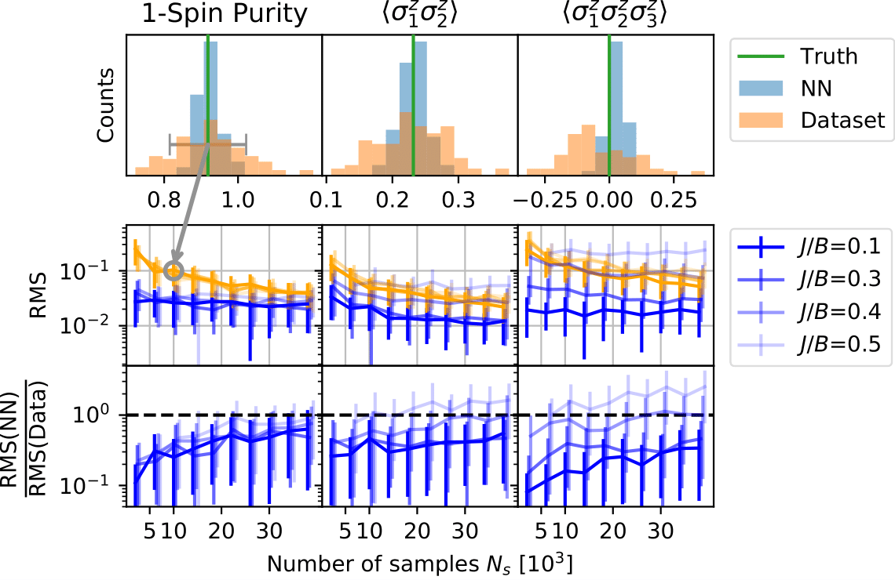
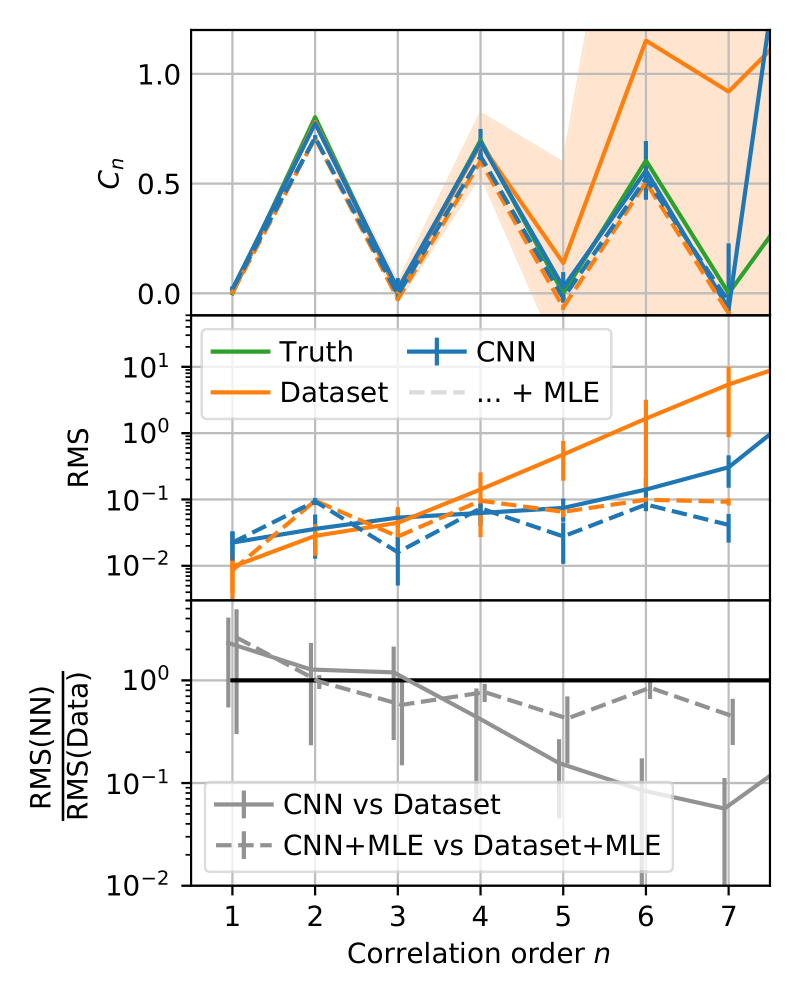

## Scalable quantum state tomography with artificial neural networks

#### The curse of dimensionality and its meaning for NISQ devices

The state of a quantum system in its most general form is given by its density matrix $\rho$. For qubit systems the size of this complex matrix is exponential in the number of system constituents: it scales as $2^N\times2^N$. This scaling is known as the 'curse of dimensionality' of quantum mechanics, limiting computational approaches to a few qubits only.

In experimental contexts, one would like to gain information on the prepared quantum state by carrying out measurements that characterize said quantum state. As demanded by the laws of quantum mechanics, these measurements are projective in nature as the post-measurement state must be an eigenstate of the measurement operator. Therefore a single measurement can never be sufficient - without the use of advanced methods, one needs on the order of $4^N$ experimental runs to be able to reconstruct a (noisy) estimate of the density matrix. Here the curse of dimensionality strikes again, rendering naive approaches insufficient beyond system sizes of a few qubits.

With quantum devices growing in size at immense rates, new tools of verification are required to properly assess their working. Here we develop an approach which neither requires exponential experimental data nor exponential computational resources, making our ansatz 'scalable'.

#### Probabilistic formulation of quantum mechanics
The measurements we assume to have access to are spin-up and spin-down projections in (randomized) $x$, $y$ or $z$-directions. These form the POVM operators

$$M^\uparrow_{x/y/z} = \frac{1}{3} |\uparrow_{x/y/z}\rangle\langle\uparrow_{x/y/z}|,\\
M^\downarrow_{x/y/z} = \frac{1}{3} |\downarrow_{x/y/z}\rangle\langle\downarrow_{x/y/z}|.$$

One can easily check that all $M$ indeed sum to unity and are strictly positive, forming a set of informationally complete POVM operators. Informational completeness refers to the fact that any (hermitian) operator may be expanded using the above operators, making them an (overcomplete) operator basis.

In turn, the knowledge of all expectation values $P$ of all $6^N$ possible POVM Kronecker products $M=M^{(1)}\otimes M^{(2)} \otimes .. \otimes M^{(N)}$ is the same as knowing the entire quantum state. These expectation values are strictly positive and sum to one, making them a completely real valued, probabilistic formulation of quantum mechanics. With this probabilistic framework in mind, the reconstruction of a quantum state from measurement data amounts to a density estimation task. Naturally, such a task is very amenable to Machine Learning (ML) inspired techniques which we exploit in our ansatz.

#### The role of neural networks
Due to recent developments in the field of Neural Quantum States (NQS) we were motivated to carry out the described task using CNNs.

The task of the CNN is the following: Given a set of samples $\{\textbf{a}^1, \textbf{a}^2, .., \textbf{a}^{N_s}\}$ where each $\textbf{a}^i=a^i_1a^i_2..a^i_N$, adjust the parameters of the model in such a way that unseen configurations are assigned a 'good' estimate of their POVM probability. In practice this is achieved by minimizing the cross-entropy between the sampled distribution and the distribution the network currently encodes, which corresponds to finding the set of variational parameters which maximizes the likelihood of the observation.

### Results

We benchmark our approach on various system sizes. For small system sizes in which it is feasible to compare the learned distribution to the exact one, we use the classical fidelity as a performance measure and benchmark it with respect to the fidelity between the maximum likelihood estimate and the exact distribution. If the latter is smaller than the former, we obtain a performance gain by employing the neural network based approach.

For system sizes beyond MLE regimes (at around 10 qubits) we use observables to characterize the quantum state under scrutiny. For both the samples generated from the learned neural network distribution and the 'bare' samples used to train the network, we compute Monte Carlo estimates of the observables of interest. If the bare samples constitute estimates that are further off than the neural network generated samples we gain by employing the neural network ansatz and vice versa.

#### 1D TFIM ground states at critical point with PBC

As a first check we employ the proposed scheme for the paradigmatic Ising model in one dimension with periodic boundary conditions at the critical point $J/B = 1$. Specifically we wish to understand how the model parameters affect the quality of the estimate and find the (expected) result that the kernel size and depth of the model have to be chosen such that correlations between all sites are possible.

These results are summarized in the figure below.

*Fig. 1: Left: CNN learns the ground state and its correlations in the paradigmatic 1D Ising model. Various kernel sizes and depths are compared. Right: Slightly altered CNN, which allows for autoregressive sampling, is given the same task. Both methods produce satisfying results and only work well once the model complexity allows to capture all relevant features of the quantum state.*

#### 2D TFIM ground states on a $4\times 4$ lattice

To further investigate the performance, gradually increasing the system complexity, we benchmark the described approach on a 2D TFIM lattice for various coupling strengths. We find that the samples generated using the neural network produce narrower estimates of observables resulting in a decreased root mean square error as compared to the plain dataset. When increasing the number of samples this advantage shrinks until it ultimately vanishes - which is to be expected, as the exactly drawn samples have to approach the exact value in the limit of a large number of samples, while the network will always contain a small bias that hinders this behavior.

*Fig. 2: Distribution of samples in observable space (top), their root mean square error (middle) and the described performance measure (bottom) as a function of the sample number for three different observables.*

#### Chain of ions with long range interactions

As a more experimentally motivated example, we study multi-particle correlators in a long range interacting model. Its Hamiltonian is given by

$$
H = -J \sum_{ij} \frac{\sigma^z_i\sigma^z_j}{|i-j|^{1.1}} - B \sum_i \sigma^x_i
$$
and the target state we are considering is its noisy ground state
$$
\rho = 0.97 |\psi_0\rangle\langle\psi_0| + \frac{0.03}{2^{16}}𝟙.
$$
Specifically, we wish to obtain estimates of higher order correlators $C_n$, a notoriously difficult task if one has no access to sophisticated estimation schemes. The observables are defined according to
$$
C_n := \frac{1}{16-n+1}\sum_{i=1}^{16-n+1}\left\langle \sigma^i \sigma^{i+1}...\sigma^{i+n-1}\right\rangle.
$$
In these settings we find that advantages may be expected by using the proposed approach and, interestingly, observe that the advantage grows for higher order correlators.

*Fig. 3: The multi-particle correlator, its Root Mean Square Error and the associated performance measure as a function of the correlation order n.*

Further reading: https://arxiv.org/abs/2109.13776
