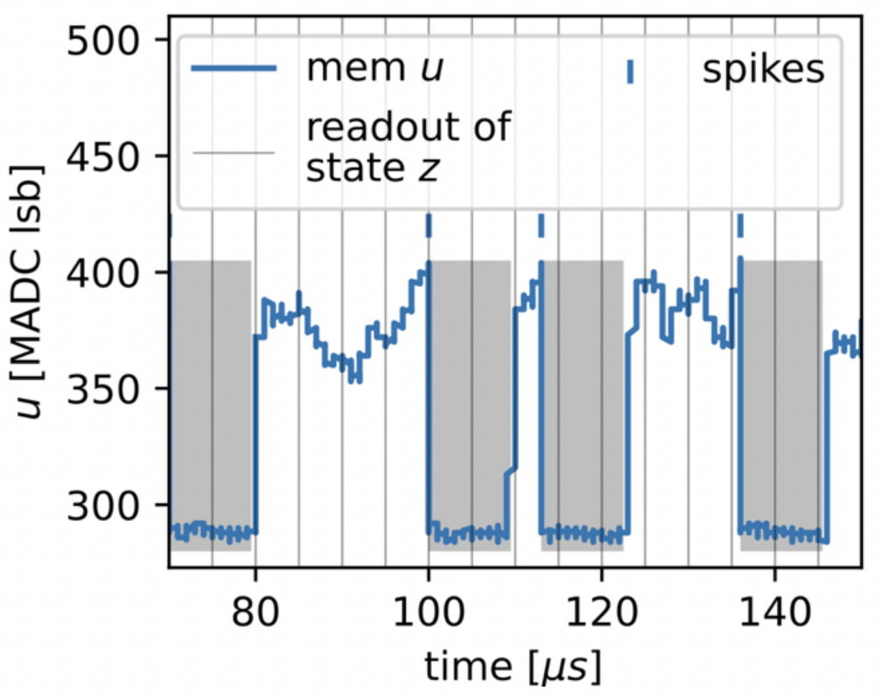
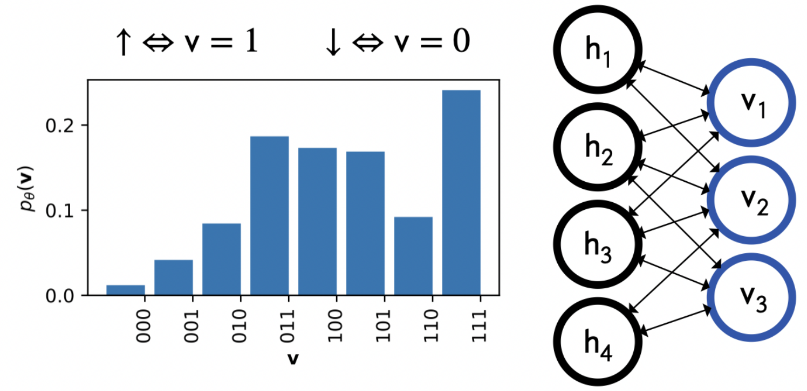
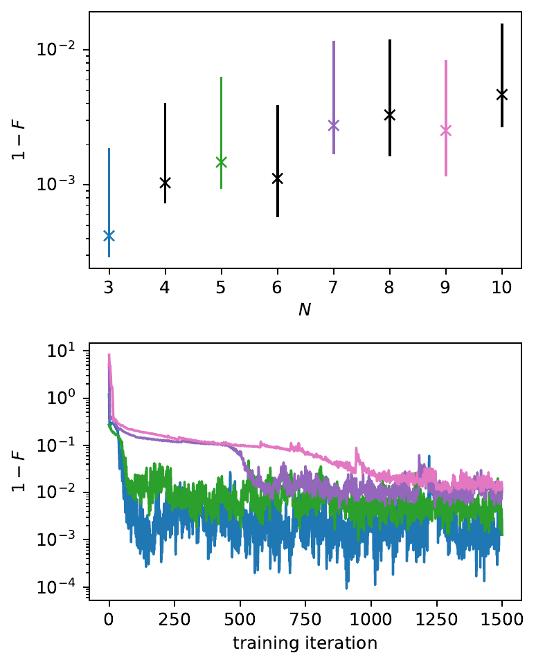
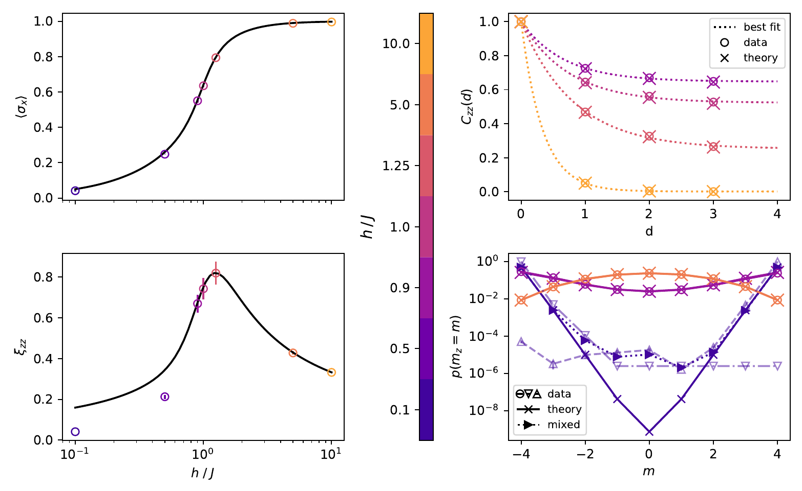

## Variational learning of quantum ground states on spiking neuromorphic hardware

#### Neural quantum states with neuromorphic hardware?

A flood of work on neural quantum states (NQS) in the past years have shown their ability to model quantum many-body systems, often in remarkably scalable fashion.
Prominently, restricted Boltzmann machines (RBM) have been successfully used for variational ground state search in quantum spin models.
However, estimating observables through sampling from these generative models rely on MCMC methods which in these high-dimensional spaces are prone to suffer long correlation times or fail to capture multi-modal distributions.

With this work we address these challenges by leveraging a brain-like sampling process in a spiking neural network (SNN) which thereby probabilistically encodes a quantum spin state.
By gradient-based minimization of the energy expectation value the network variationally learns ground states of a given Hamiltonian.
We implement this approach with the BrainScaleS-2 neuromorphic chip which emulates a SNN, enabling inherently parallel sampling independent of the network and system size.
Finally, we study the performance and limitations for the quantum Ising model.

#### Spiking sampling like in the brain!

Figure 1: Membrane potential of a spiking neuron.

The dynamics of spiking neurons can be naturally interpreted as sampling from high-dimensional binary space.
The activity of each neuron $i$ is a function of its membrane voltage $u_i(t)$.
When it crosses a threshold potential, $u_i > u_\text{thresh}$, a spike is sent to connected neurons $j$ whose potentials $u_j$ are impacted proportional to the network weight $w_{ij}$ and for a duration $\tau_\text{syn}$.
The sending neuron is reset after the event and can not spike during a refractory period of the same length $\tau_\text{ref} = \tau_\text{syn}$.
Equating the two neuron states 1 = "active" = "refractory (has recently spiked)" and 0 = "inactive" = "has not recently spiked", the readout of a SNN with $N$ neurons describes a sampling process within the $\{0,1\}^N$-space.
Given a few additional details it can be shown that samples are drawn from a Boltzmann distribution parameterized by the weights and biases, which we summarize as a generalized parameter $\theta$.

#### Encoding and variational learning for quantum ground states

Figure 2: Probabilistic encoding of quantum spins in two-layer network.

We assume a stoquastic Hamiltonian in which case the ground states can be expressed with real wave function coefficients such that probabilistic modeling becomes straight forward: $|\psi_{\theta} \rangle = \sum_{\{v\}} \sqrt{p_\theta(v)} | v  \rangle$ where $\{v\}$ denotes the $z$-basis configurations.
Note that we encode the quantum system in a subset of the neurons (the visible layer), while hidden neurons mediate  correlations between them. 

Figure 3: Neuromorphic chip in the loop.

For the variational method we exploit the Boltzmann character of the distribution and derive the analytical gradients with respect to the network parameters, e.g. $\text{d}/\text{d}{w_{ij}} E_\theta \propto \langle E^\text{loc}(v) - E_\theta) v_i h_j \rangle_{p_\theta}$ where $E^\text{loc}(v) = \sum_{v'} H_{v,v'} \sqrt{p_\theta(v')/p_\theta(v)}$.
One iteration starts with sampling from the neuromorphic chip, which encodes the current trial state.
These samples are read out to a host computer where the gradients are calculated based on above sample averages.
Finally, an adaptive optimizer is used to update the parameters of the neuromorphic chip.

#### Results and limitations

We have tested our method for searching ground states of the antiferromagnetic quantum Ising model $H = -J\sum_{<i, j>} \sigma_z^i\sigma_z^j - h \sum_i \sigma_x^i$ and were able to learn high-fidelity representations of the critical ground states of up to $N=10$ spins.

Figure 4: Quantum fidelity as function of system size and training iteration.

Furthermore, we studied the phase transition (for spin chain of $N=8$) by estimating the magnetization $\langle \sigma_x \rangle$ and two-point correlations $C_{zz}(d)$ and found excellent agreement with theory.
At the points deeper into the ferromagnetic phase ($h \rightarrow 0$) the ground states increasingly approach a degenerate superposition of the two extreme configurations $|0\rangle^{\otimes N}$ and $|1\rangle^{\otimes N}$.
Thus, the system becomes susceptible to small perturbations which spontaneously break the symmetry.
This is reflected in the SNN dynamics as the symmetric distribution requires both highly synchronous activity and synchronous inactivity which is prohibitively hard for the points $h/J \in \{0.1, 0.5\}$.
Consequently, the SNN breaks the symmetry by entering one of the two local minima.
However, by combining multiple runs one can still form a good approximation of the ground state.

Figure 5: Phase transition in the quantum Ising model and symmetry breaking in the ferromagnetic phase.

For system sizes N > 10, we observed a significant drop in the representational power of our neuromorphic implementation.
We investigated the possible causes for this and found that the currently available parameter stability on BrainScaleS-2 leads to a limited accuracy of gradients.
This is the main limitation that has to be overcome in order to scale to large system sizes.

Much more information can be found [here](https://arxiv.org/abs/2109.15169)
