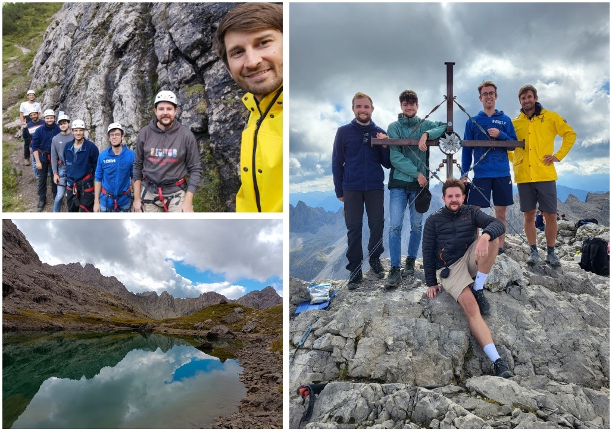

Like last year, the MBQD group decided to use a bit of gradient ascent to not only train our minds and bodies but also to strengthen the team spirit. This time around our trip took us to Hanauer Hütte in Austria.

Lots of hiking was still involved of course! After the rainy ascent to the hut on the first day, we decided to make use of the nice weather in the morning of the second day and started hiking early. We went through the Dremelscharte and rested next to a small mountain lake, the Steinsee. Rumors are some of us even took a small swim! We continued to round Dremelspitze and a few attempted to climb to its peak, but in the end only our group leader Martin made it all the way up top! Not a lot time left for talks after this much hiking but Moritz still managed to teach us about classical shadows.

The next day was supposed to be rainy except for early morning. So we scaled the Klettersteig next to the hut and then continued the talks. This year we took the opportunity to teach each other about interesting topics or tools only loosely related to one's main research. This broadened our understanding and sparked interesting discussions! The scientific program was rounded out by a Pub quiz in the evening(thanks Johannes!).

Overall, the group had a fantastic time together and we are very much looking forward to going to mountains again next year to talk physics, have interesting discussions and of course hike a lot and spent some time together outside the office!
