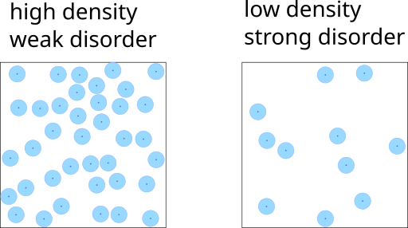
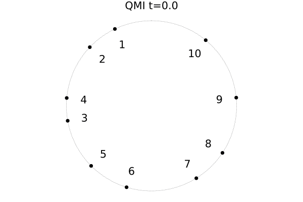

Our new paper, *[Pair localization in dipolar systems with tunable positional disorder](https://link.aps.org/doi/10.1103/PhysRevB.106.134212)*, has recently been published in Physical Review B!

By now it is no news that quantum systems subject to some kind of (quenched) disorder may not achieve thermal equilibrium until very late times. This phenomenon called many-body localization is commonly studied in spin models where randomness is introduced via random on-site potentials or random couplings. 

In our paper, we consider a new type of disordered couplings induced by positioning power-law interacting spins randomly within some given volume. This kind of disorder arises naturally in cold atomic gases, where electronic interactions give rise to couplings $J\propto r^{-\alpha}$ with $\alpha=3$ for direct dipolar and $\alpha=6$ in the case of Van der Waals interaction. 

Furthermore, we consider gases of Rydberg atoms, where the positions are not entirely random but subjected to the Rydberg blockade. This essentially means, there is a minimal distance $r_b$ between atoms. We can use this second length scale to effectively control how disordered the system is: When the density is high, the Rydberg atoms need to arrange themselves in an orderly manner, whereas with low density their positions become more and more uncorrelated. 

Through numerical simulation, we found, that for low densities this system, despite featuring long-range, all-to-all interactions, indeed shows localization! And there is an intuitive explanation: Although in principle every spin can interact with each other spin, for strong disorder every spin has one closest "partner" it will interact with most. These pairs of spins get strongly entangled with each other such that due to monogamy of entanglement, they effectively decouple from the rest of the system. Here is a small visualization of the short-time dynamics of 10 spins in a 1D chain with periodic boundaries:

Shown is the quantum mutual information $QMI(A,B) = S(A)+S(B)-S(AB) $ between all pairs of spins. The line's thickness is roughly proportional to the QMI with QMI values smaller than $10^{-5}$ not drawn at all. We can clearly see the pairs of spins - each oscillating with their own frequency!

For details, please enjoy reading the [full paper](https://link.aps.org/doi/10.1103/PhysRevB.106.134212)!
