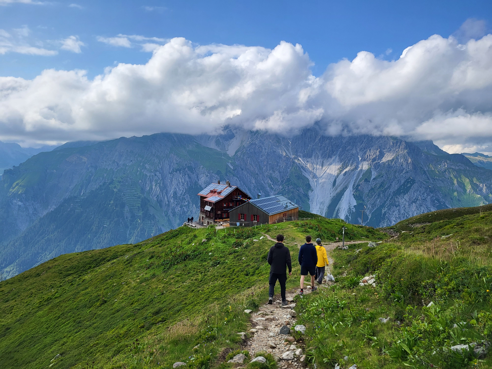
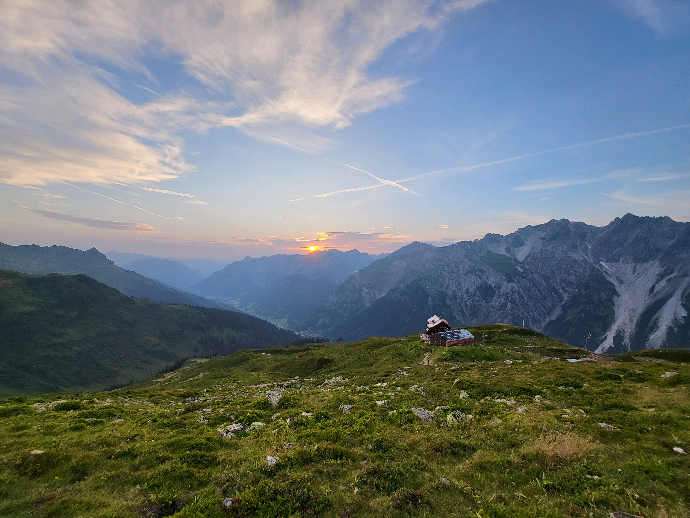
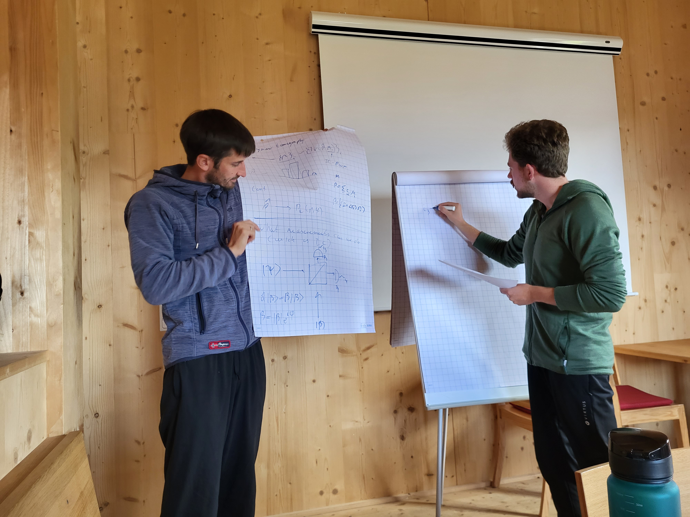

If there were two lessons I learned during the MBQD summit at the Kaltenberghütte, it’s how diverse the group interests are, and that one gets the pleasure to see the sunset twice when first laying on the belly and then standing up once the sun is beyond the horizon. “Lifehack." - O-tone Adrian A.

Due to a preceding school, I joined the group one day after the official start. At this point, the group (comprising Martin, Moritz, Niklas, Adrian A. and Mirco) had already mastered the summit and used the clear weather for a hike: Leaving the lake behind the Kaltenberghütte on the left, the group hiked up the western slope of the Stubner Alboakopf. From the ridge, one could see the two lakes of the Kaltenbergsee calmly resting like two weakly interacting BECs.

I reached the hut at noon (with an HDMI cable but without Martin's missing sunglasses) and was introduced to the part of the group that I did not meet in Heidelberg. We spent the afternoon playing cards – to sharpen our strategic thinking – and Mäxchen – to improve our ability to identify liars.  There are no words describing how stunning it is to stand on a mountain and see the day go, while the sun has already set for everyone down in the valley. Adrian sparked the atmosphere with the above mentioned lifehack (try it out!).

The next day, we started with the scientific program, now supported with the hut’s beamer that balanced on a hip flask. Martin brought our attention to quantum computing with bosons, which will be one of the group’s main focuses in the future. Afterwards, Adrian gave an instructive talk about continuous variable systems, Niklas followed with a paper about a photonic implementation. Despite the fitful weather, part of the group went climbing in the afternoon. The other fraction (including me who grabbed the wrong “rain jacket" when packing) stayed at the hut. Thereby, we could also get to know each other better. The climbing fraction returned content, and we spend the evening with games, while watching the valley fill up with clouds.

The last day started rainy, and we decided to trust the most promising weather forecast, trying to stay optimistic for the pending descent. Sprinting to the seminar room next door, wrapping in warm jackets, hip flask under the beamer. Let’s go. Moritz gave a presentation about state-of-the-art neural quantum states, placing the focus on bosonic systems. Mirco concluded the scientific program by moderating a discussion about necessary, yet understated, soft-skills and the future organization of the group. It was still raining as we descended, jumping over the river that emerged in the footpath. The farmer, who some of our group wanted to buy goat cheese from, was not available.
The sunglasses of Martin remained untraceable.
In the train, we found some empty seats such that we could sit together until I had to leave the group in Ulm. At dinner time, sandwich cheese was traded for jam while some group members had already fallen asleep.

Like that, the MBQD summit ended, and I am already looking forward to next year, to see how our group – now located in Jena – has evolved by then.