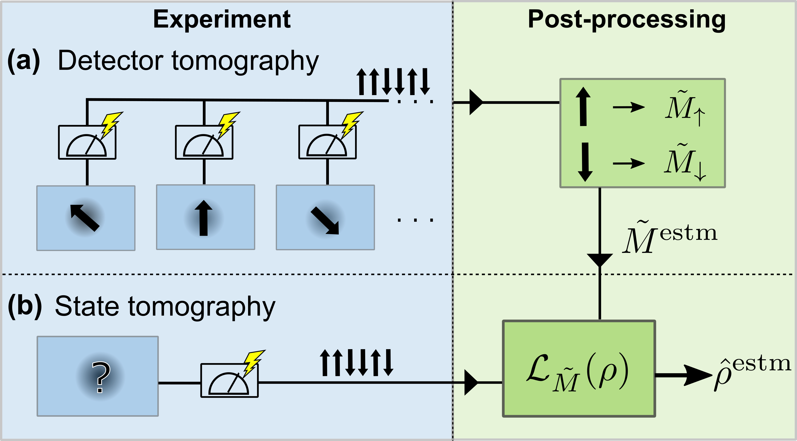

Quantum technology promises to revolutionize many fields, ranging from finding better materials, faster drug discovery, optimal routing, improved cryptography, and many more. However, quantum systems are incredibly sensitive, and even a small perturbation can throw off the whole computation, losing any advantage it has over classical methods. The whole field of quantum technologies is highly invested in finding methods for accurate quantum control.

As noise stands out as a huge barrier, a lot of attention has been afforded to correcting errors in gate-based computations, recently shown to be paramount for any useful quantum advantage. One important source of errors not covered by these gate-based error correction methods are readout errors. Mitigation of readout errors has still received little attention compared to the aforementioned error correction. 

Readout errors are broadly captured by misidentification of the measurement outcome. This could be as simple as misidentifying whether a value was 0 or 1, analogue to classical computers, or as complicated as having the state of a qubit across the chip influence the readout outcome of another qubit. 

The goal of our work was to tackle a problem that is currently not sufficiently addressed within readout error mitigation, which are methods that capture a general set of readout errors, while light-weight enough to be applied to system sizes of up to 6 qubits. In this work, we develop such a protocol and verify its utility experimentally on a superconducting qubit chip. 

Our method consists of two stages: First, a calibration stage, where the measurement setup itself is characterized. We find out what imperfections there are and how they could affect the measured values. Second, we perform the experiment of interest, which in our case is quantum state tomography, an experiment that reconstructs the full quantum state of the system. The key insight of our procedure is that we directly integrate the readout noise, gained in the first step, into the state estimator used in the second step. 

We characterize the performance of our new readout error mitigation method by varying important noise sources present in superconducting qubit systems.
These are non-optimal readout signal amplification, increased back-action to the qubit, insufficient number of photons in the readout resonator, off-resonant qubit drive, and effectively shortened coherence times.
We see a consistent ability to mitigate any added error by lowering the amplification and decreasing the readout power. Even with optimal experimental parameters, we see a large improvement. We identified noise sources for which readout error mitigation worked well and observed that the precision of state reconstruction is improve by a factor of up to 30, enabling us to reconstruct quantum states even in a very noisy quantum device.

Our method adds to the toolbox of readout error mitigation schemes and opens up new possibilities for systems with noisy readouts where accurate knowledge of the quantum state is required. As our developed method is not specific to any quantum computing architecture, you can also implement it on your favourite one, by using our code made publicly available on [GitHub](https://github.com/AdrianAasen/ABQT) - check our [publication](https://www.nature.com/articles/s42005-024-01790-8) for details.