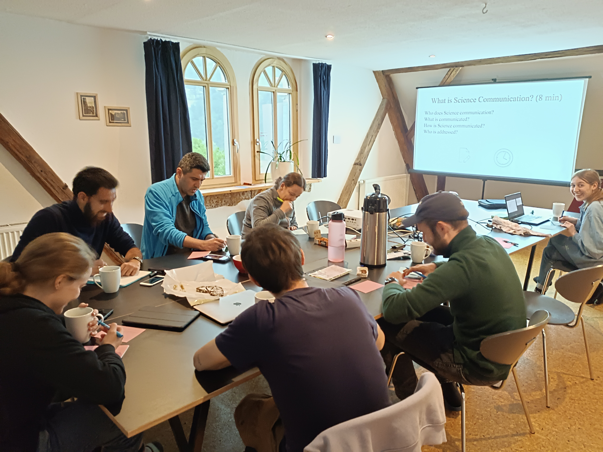
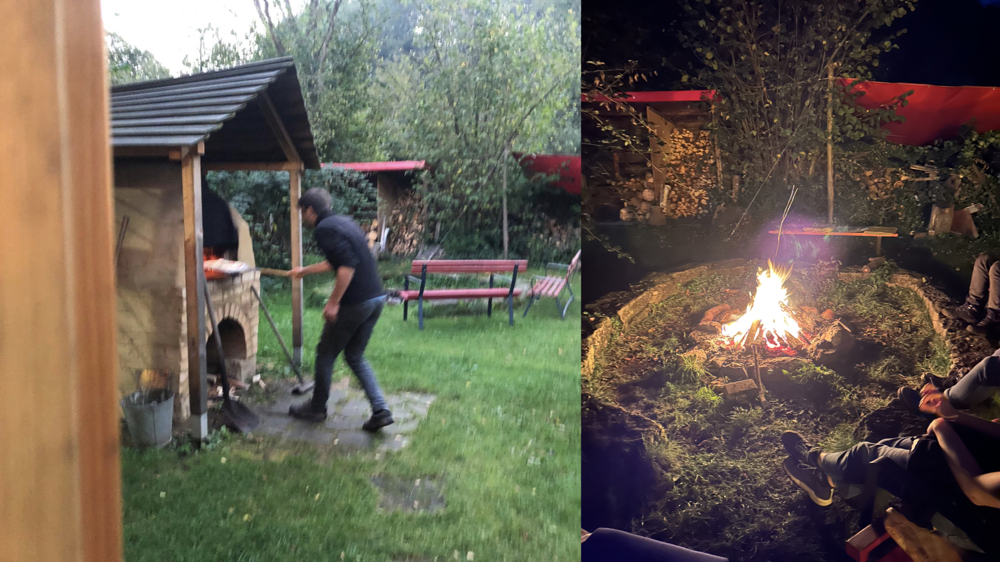
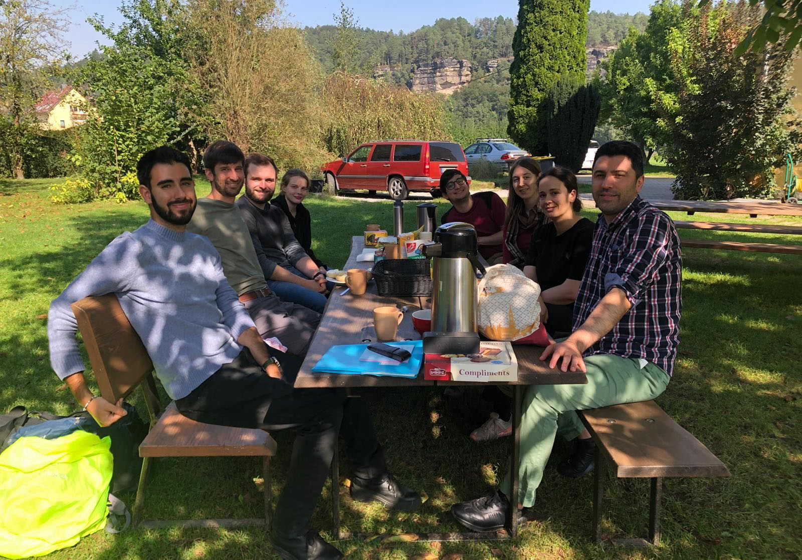

For this year's group retreat, Martin decided that Rathen would be the most suitable place to establish new synergies within the group. Everyone was quite excited when we met on the train. Once we saw that we were riding directly into a massive rain cloud and heard about the increasing flooding risk of the Elbe River, it was clear to everyone that this retreat would be an adventurous one.

 

When we arrived in Rathen, the view of the surroundings was astonishing and the hostel in which we stayed was very comfortable with a big garden and a barn that they had repurposed into a huge living space with a kitchen and even a fireplace. After a short round of playing Wizard, we started the first day with Martina's science communication workshop. We exchanged ideas about its definition and how we, as a research group, could contribute to it ourselves. The "Kinderuniversität" and "Night of Science" were among some of the favoured suggestions.

On the first morning, we organized ourselves into two groups; Maike, Martina and Ege focused on applying neural networks on continuous-variable systems while Elena led a discussion about high harmonic generation and the violation of separability criteria for entanglement with the others. 

Outside we were keeping an eye on Elbe's level but it was getting too foggy to see anything. However, this did not stop us from "hiking to the supermarket" all the way to Königstein. On our way, we could tell how the area inspired the painter Caspar David Friedrich (as you can see from the misty photo). Martin, Maike and Niklas did some rock climbing too because otherwise this retreat would not have been complete. After we did the groceries, in order not to lose the next train, the whole group had to run to the station with full grocery bags. But when we finally arrived at the station, our train had a 20 min delay. Quite a dramatic scene, which will stay in our minds for a long time.

Back at the hostel, Adrian Braemer and Mirco had already arrived. Sadly Adrian Aasen couldn't join this retreat due to multiple flight cancellations. In favour of the group tradition inspired by him, we planned to make a taco night. After a very tasty dinner, we went up to the conference room, but this time to play a very fun physics-related, quiz game created by Mauro.

The next day, the weather was surprisingly good, so we started the day with a beautiful hike. This time we got to see much more of the stunning views that the area had to offer, where we took a nice group picture.

Once we were back at the hostel, we dedicated the afternoon to some discussions, where Javad presented his project idea on entanglement dynamics in open quantum walks, Mauro illustrated some questions about entanglement evolution for long-range systems within the quasi-particle picture and Niklas sketched the experiment he is currently working on about multipartite entanglement of bosonic modes. The presentations led to a very involved discussion where everyone gave fruitful inputs. At the end Martin surprised us all with a former member of the group joining us on Zoom: Dr. Moritz Reh! 

For our last night in Rathen we had to have something special: Martin's delicious Pizza, accompanied by a ping-pong tournament and a heartwarming bonfire.

Before our departure, Adrian Braemer and Mirco gave us a talk about soft-skills and new research tools involving AI. We then concluded this retreat with a nice brunch outside in the sun which gave us the inspiration for our new group name: Quantum Information & Quantum Simulation (QIQS).

On our way back to Jena, we had the luck of sitting all together on the train for a last game of Wizard while enjoying the left buns from the brunch. We can nearly hear you ask: "Sorry, what did you say?"
